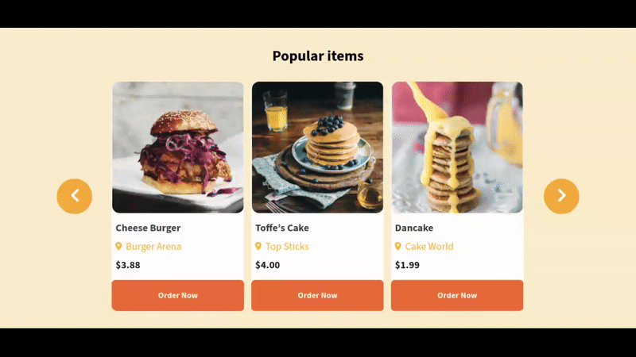

# Carousel Cards - React JS

### 💻 Sobre o projeto

- Esse projeto foi desenvolvido para praticar o básico de React Js.

### 🎨 Layout

- A baixo o design da aplicação em execução.

  

### 🛠 Tecnologias

- As seguintes ferramentas foram usadas na construção do projeto:

- HTML
- CSS
- JAVASCRIPT (React Js)

### 📝 Licença

- Fique a vontade para contribuir...